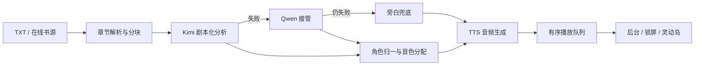

<p align="center">
  
</p>

<h1 align="center">扶摇FM</h1>

<p align="center"><strong>让小说不只是被朗读，而是被演出来。</strong></p>

<p align="center">
  
  
  
</p>

扶摇FM 是一款独立的 iOS AI 有声小说 App。它会先理解小说中的旁白、对白、角色、情绪和场景，再为不同角色分配声音，把一章文字组织成可以连续播放的多角色有声剧。

这不是一个只展示 API 调用的 Demo。项目已经走通从小说导入、AI 剧本化、多角色语音合成，到边生成边播放、书架管理、后台播放、锁屏控制和灵动岛展示的完整 App 链路，并曾完成 TestFlight 外部测试。

项目从想法到真实 App 的开发故事，见：[《三个月，我和 AI 一起做了一款 iOS App》](https://mp.weixin.qq.com/s/IdGTOkqIpJuqokEyeYrHSw)。

## 开源版说明

本仓库提供完整的 iOS 客户端、共享业务层和可自行部署的轻量后端。

- 代码中不包含开发者的 API 密钥、生产环境变量或用户数据
- 不分发阿里云号码认证等闭源二进制 SDK
- 原有在线后端已经停用；需要云端登录、激活等能力时，请自行部署 `backend/`
- AI 分析和 TTS 均采用自带密钥（BYOK）方式配置
- 内容处理仅应用于原创、已获授权或公版作品

## 它能做什么

### 从小说到“可演播剧本”

- 导入本地 `TXT` 小说并自动拆分章节
- 从发现页搜索、浏览和缓存在线书籍内容
- 将长章节拆成适合模型处理的文本片段
- 识别旁白、对白、角色、性别、叙事位阶、情绪和场景
- 归一化角色别名，并在章节之间保持音色绑定稳定

### 多角色有声剧

- 为旁白、主角和配角智能分配不同声线
- 将 AI 标注的情绪、场景和强度传递给 TTS
- 支持讯飞、Azure 和 OpenAI 等 TTS 提供商
- Kimi 分析失败时可切换 Qwen；云端分析都不可用时退化为旁白播放

### 为真实听书体验设计

- 长章节并发生成音频，同时保证播放顺序确定
- 前序片段就绪即可开始播放，无需等待整章生成完成
- 播放当前章节时预取下一章
- 保存章节、片段和播放进度
- 支持后台播放、锁屏/控制中心控制、封面与进度同步
- 通过 iOS 原生媒体播放状态适配灵动岛

## 工作流程



## 技术栈

| 领域 | 实现 |
| --- | --- |
| iOS App | Swift、SwiftUI、iOS 16+ |
| 音频 | AVFoundation、MediaPlayer |
| AI 文本分析 | Moonshot Kimi、阿里云百炼 Qwen、客户端旁白兜底 |
| 语音合成 | 讯飞、Azure、OpenAI |
| 数据与缓存 | 本地文件、应用存储、章节与音频缓存 |
| 可选后端 | Python 3.9+、标准库 HTTP Server、SQLite |
| 工程生成 | XcodeGen |

## 项目结构

```text
App/                    # SwiftUI App、页面与交互
Sources/
  Bookshelf/            # 书架、书源、章节与缓存
  TextAnalysis/         # 小说结构化分析、角色归一和降级链路
  TTSEngine/            # TTS 提供商、音色与批量生成
  AudioMixer/           # 音频处理
  Player/               # 播放队列、进度与系统媒体控制
Resources/              # App 资源
Docs/                   # 架构、开发和配置文档
backend/                # 可选登录、激活与权限后端
project.yml             # XcodeGen 工程定义
Package.swift           # Sources 共享层的命令行编译检查
```

## 快速开始

### 环境要求

- macOS 与完整安装的 Xcode
- iOS 16+ 模拟器或真机
- [XcodeGen](https://github.com/yonaskolb/XcodeGen)
- 至少一个 AI 分析服务和一个 TTS 服务的 API Key

### 生成并运行 iOS 工程

```bash
git clone https://github.com/baixiaobai-ll/fuyao-audiobook.git
cd fuyao-audiobook
cp Config.plist.template Config.plist
xcodegen generate
open 扶摇.xcodeproj
```

也可以运行 `./setup.sh` 完成环境检查、创建本地配置并生成工程。

在 Xcode 中选择 `扶摇` scheme、模拟器或真机后运行。`Config.plist` 已被 Git 忽略，不要提交真实密钥。

### 配置 AI 与 TTS

配置读取优先级为：环境变量 → Keychain → `Config.plist`。

| 配置项 | 用途 |
| --- | --- |
| `KIMI_API_KEY` / `MOONSHOT_API_KEY` / `AI_API_KEY` | 默认 Kimi 文本分析 |
| `QWEN_API_KEY` / `DASHSCOPE_API_KEY` | Qwen 主动选择或 Kimi 失败后的接管链路 |
| `TTS_API_KEY` | 语音合成服务密钥 |
| `AI_PROVIDER` | `kimi` 或 `qwen` |
| `TTS_PROVIDER` | `xfyun`、`azure` 或 `openai` |
| `AUTH_API_BASE_URL` | 可选的自部署登录后端地址 |

详细配置见 [`Docs/API密钥配置.md`](Docs/API密钥配置.md) 和 [`Config.plist.template`](Config.plist.template)。

### 编译共享业务层

```bash
swift build
```

该命令只检查 `Sources/` 下的 `AIAudioBook` 共享库；完整 App 请使用 Xcode 构建。

### 可选：启动本地后端

登录、激活码和权限状态由 `backend/` 提供。仅使用本地小说与客户端能力时，可以按自己的产品流程调整或绕过这些云端功能。

```bash
cp backend/.env.development.example backend/.env
python3 -m backend.main init-db
python3 -m backend.main doctor
python3 -m backend.main serve --host 127.0.0.1 --port 8787
```

生产环境必须使用真实认证提供商、HTTPS 和反向代理，不要把开发用 mock 配置或 `8787` 端口直接暴露到公网。部署说明见 [`backend/DEPLOY.md`](backend/DEPLOY.md)。

## 第三方 SDK

仓库不分发阿里云号码认证等闭源 SDK。默认开源工程不包含运营商一键登录能力，可使用其他登录流程或自行从服务商官方渠道获取兼容版本并在本地集成。

不要把下载得到的 `xcframework`、资源包、示例压缩包或供应商密钥提交到仓库。更多说明见 [`THIRD_PARTY_NOTICES.md`](THIRD_PARTY_NOTICES.md)。

## 项目状态

扶摇FM 已经具备完整产品主链路，但仍是持续演进中的个人开源项目。适合继续探索的方向包括：

- 提升角色识别、别名归一和跨章节音色一致性
- 优化长章节生成速度、失败恢复和缓存管理
- 增加更多可合法接入的内容来源与 TTS 提供商
- 完善自动化测试、无障碍体验和国际化
- 将需要保密的第三方 API 调用进一步迁移到自部署代理

欢迎通过 [Issues](https://github.com/baixiaobai-ll/fuyao-audiobook/issues) 提交问题和建议。

## 内容、隐私与安全

- 仅处理你有权使用的内容，并遵守内容来源的服务条款、访问规则和著作权要求
- 不要把生产密钥放进源码、提交历史或可分发的 App 包
- 公开部署前请替换示例域名、证书路径和登录供应商配置
- 安全问题请按 [`SECURITY.md`](SECURITY.md) 中的方式反馈

## License

本项目使用 [Apache License 2.0](LICENSE)。第三方服务、SDK、模型及内容来源仍受各自条款约束。

---

“大鹏一日同风起，扶摇直上九万里。”
